# E-commerce Sales Analysis (Python + MySQL)

Analysis of a Brazilian online marketplace (Olist) to understand revenue, product performance, customers and delivery.

## Business questions
- How much revenue and how many orders does the business have?
- How do sales change month by month?
- Which categories and states drive revenue?
- How fast are orders delivered, and how often are they late?
- How do customers pay, and how many come back?

## Tools
Python (pandas, matplotlib), SQL (SQLite and MySQL: joins, CTEs, window functions), Jupyter Notebook, MySQL Workbench

## Dataset
[Brazilian E-Commerce Public Dataset by Olist](https://www.kaggle.com/datasets/olistbr/brazilian-ecommerce) (Kaggle). Only delivered orders are analysed.

## Key findings
- **Revenue and orders:** Total revenue is 13,221,498.11 from 96,478 delivered orders, with an average order value of 137.04.
- **Trend:** Revenue grew from 111,798.36 in January 2017 to 838,576.64 in August 2018. The best month was November 2017, possibly due to Black Friday sales.
- **Categories:** The top category is health_beauty (9.3% of revenue). The top 10 categories give 62.4% of revenue.
- **Geography:** SP (state) alone brings 38.3% of revenue.
- **Delivery:** Average delivery takes 12.6 days, and 8.1% of orders arrive later than promised.
- **Payments:** credit_card is the most used payment method (78.3%).
- **Loyalty:** Only 3.0% of customers order more than once.

## Recommendations
- **Focus on top categories:** prioritise stock, ads and seller support for the top 10 categories, and review the weakest ones before spending more on them.
- **Prepare for peak season:** revenue peaked in November 2017, so prepare stock, delivery capacity and ad budget before November each year.
- **Reduce dependence on one state:** SP brings 38.3% of revenue, so protect this market and test promotions or faster delivery in other states.
- **Improve delivery reliability:** work with carriers on the slowest routes and give more realistic delivery dates, because late delivery hurts satisfaction and repeat purchases.
- **Build customer loyalty:** send follow-up emails and offer a small discount on the second purchase, since only 3.0% of customers order again.
- **Keep credit card checkout smooth:** credit cards make up 78.3% of payment value, so keep this checkout fast and offer clear installment options.

## Screenshots

### Notebook charts (Python)
**Monthly revenue trend**
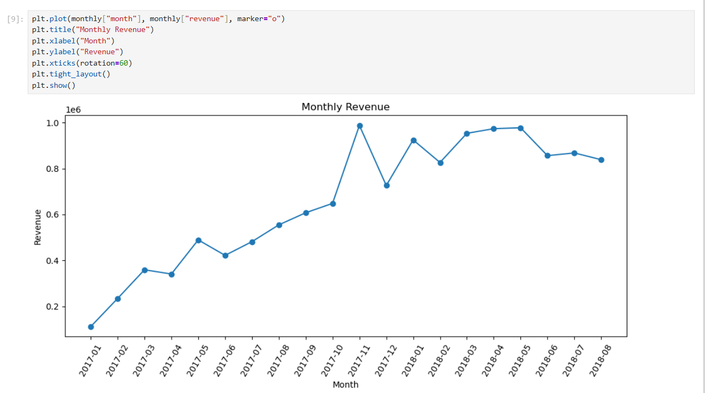

**Top 10 categories by revenue**
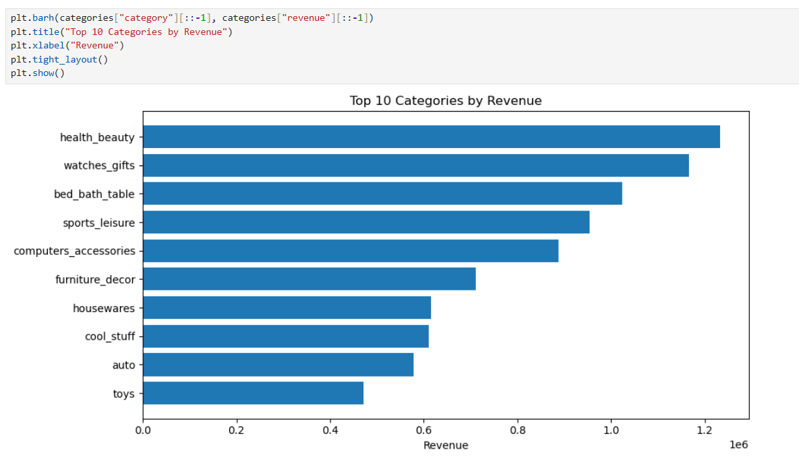

**Top 10 states by revenue**
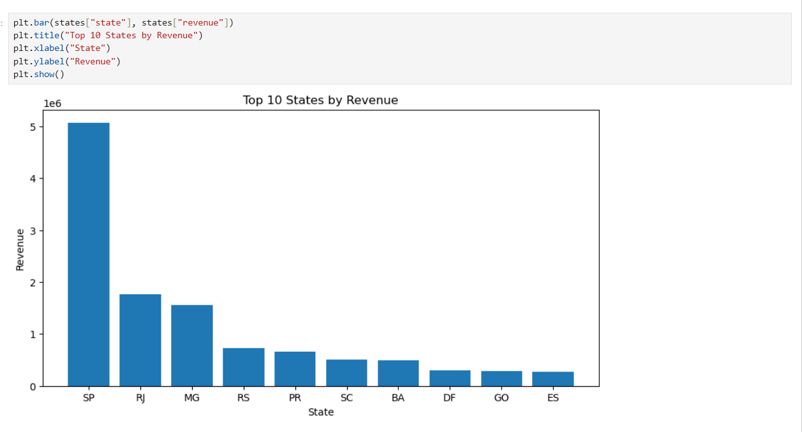

### SQL queries and results (MySQL Workbench)
**1. Order status breakdown**
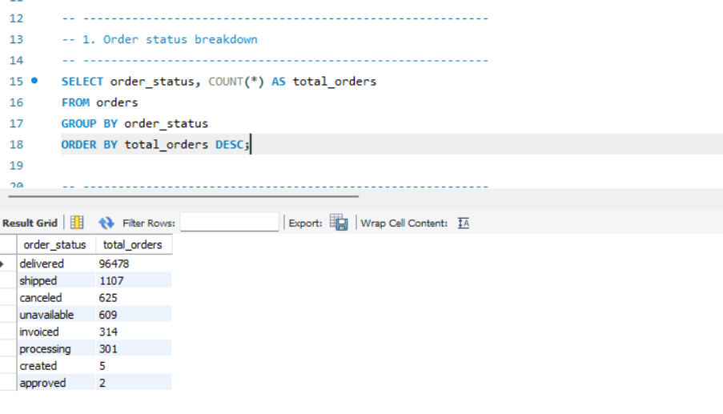

**2. KPIs: revenue, orders, average order value**
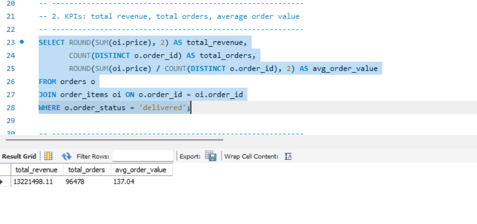

**3. Monthly revenue**
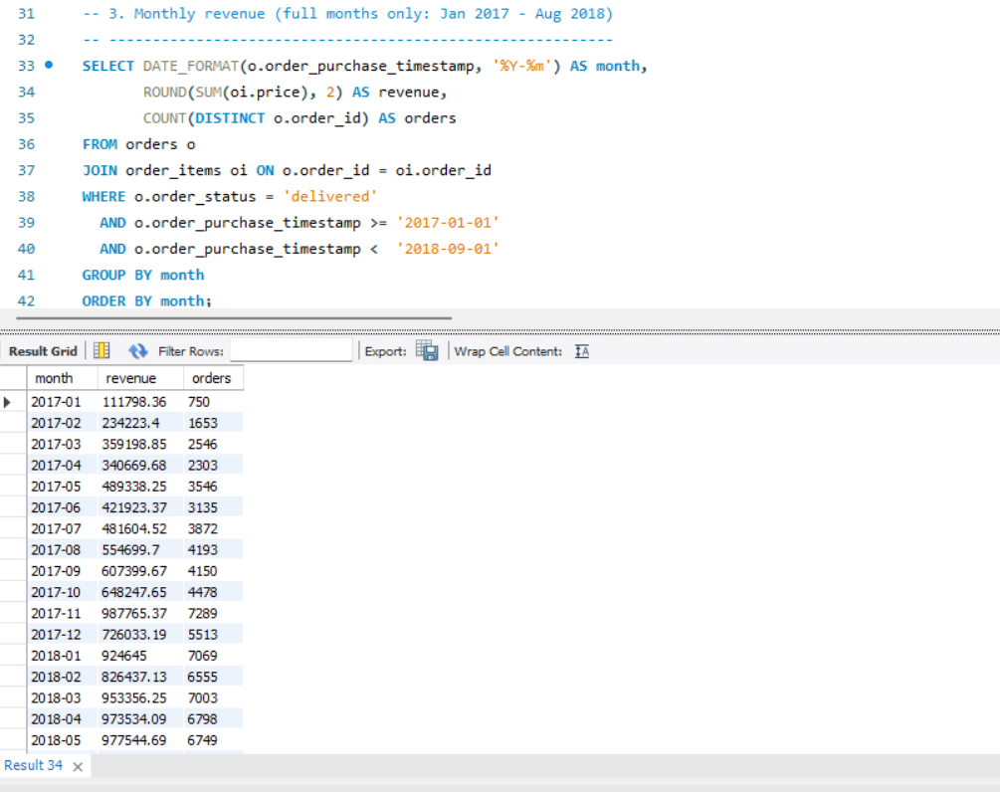

**4. Month-over-month growth (CTE + LAG window function)**
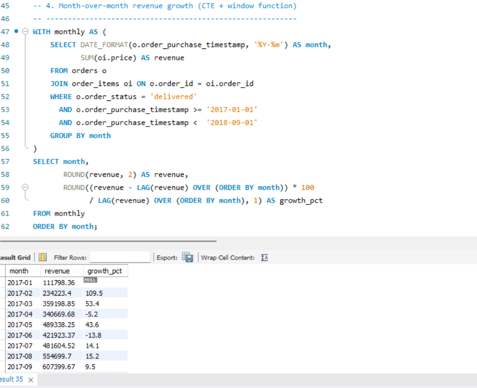

**5. Best month**
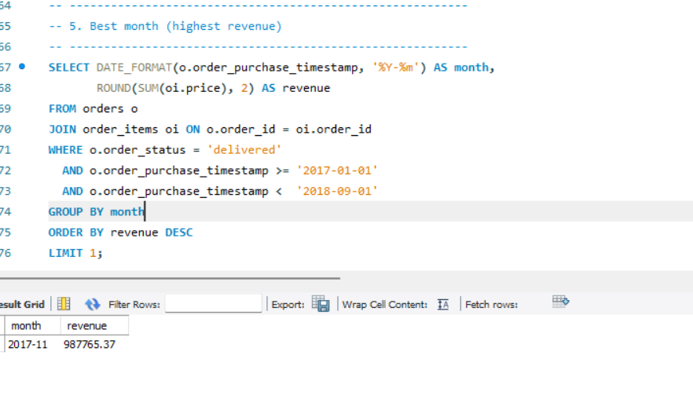

**6. Top 10 categories with revenue share**
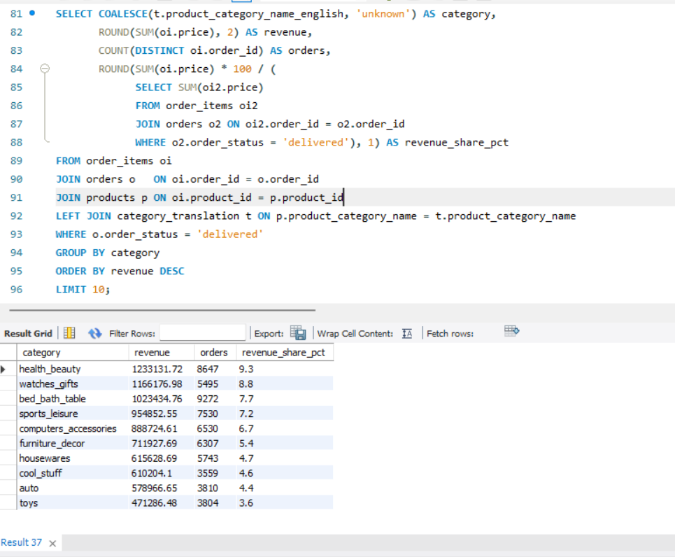

**7. Top 10 states with revenue share**
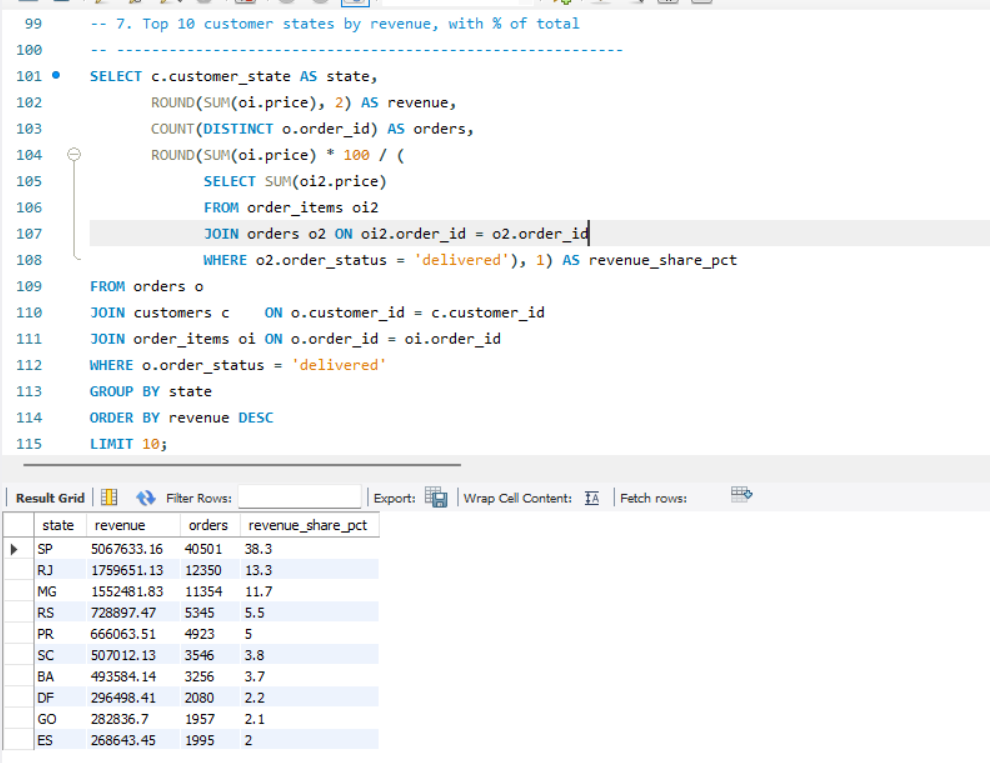

**8. Delivery performance**
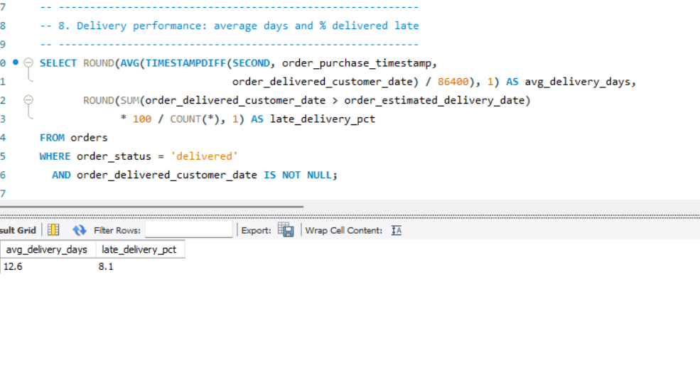

**9. Payment methods**
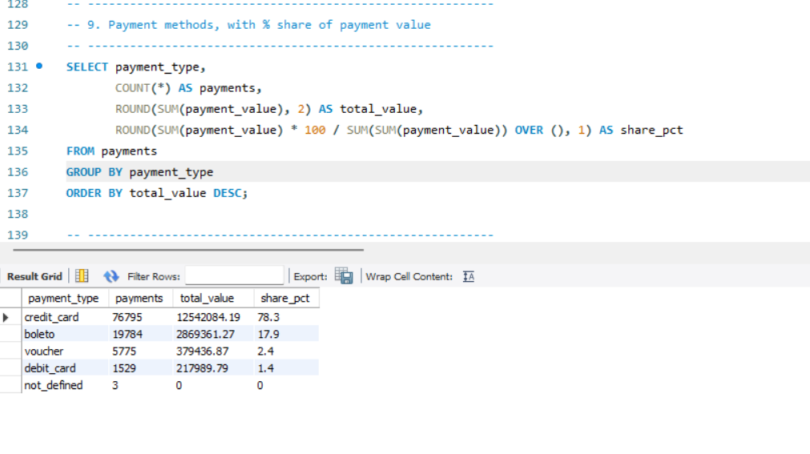

**10. Repeat customers**
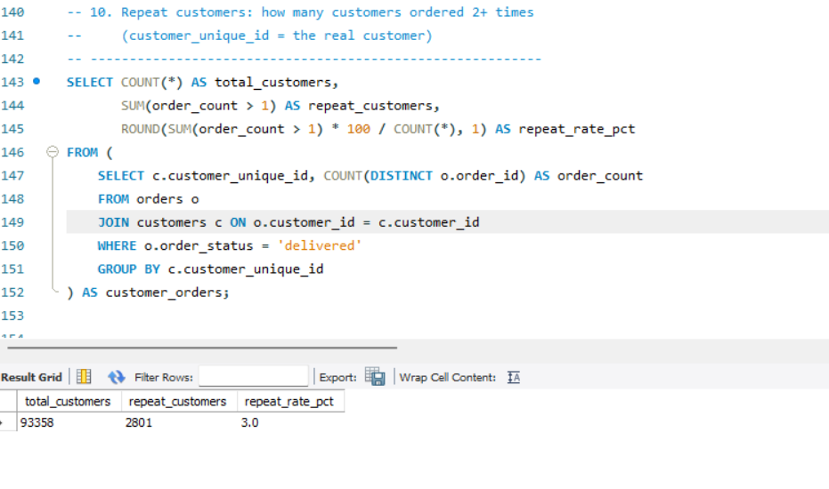

**11. Top 10 customers by spend (RANK window function)**
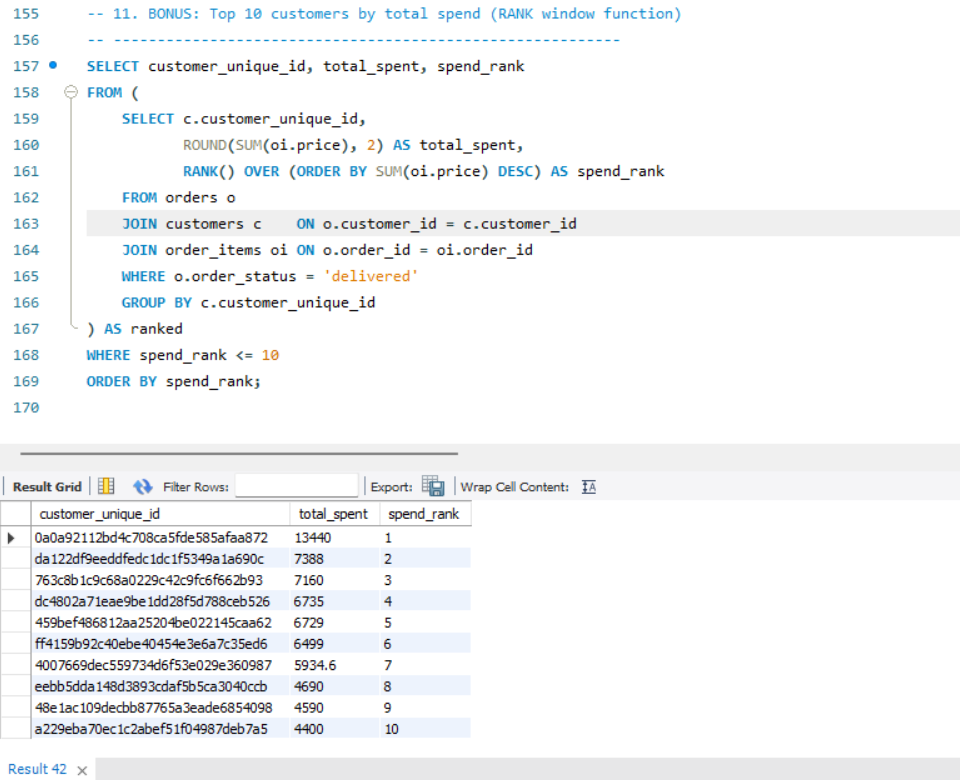

## How to run
1. Download the dataset from Kaggle and put the CSV files in a folder named `data/` next to the notebook.
2. Install the libraries: `pip install pandas matplotlib jupyter`
3. Open `ecommerce_sales_analysis.ipynb` and run all cells.
4. To use MySQL, load the CSV files into a database named `olist`, then run the queries in `queries_mysql.sql` (MySQL 8.0+).

## Limitations
- The data covers only 2017 to 2018, and the first and last months are incomplete.
- Revenue uses product price and excludes shipping (`freight_value`).
- There is no cost data, so profit cannot be calculated.

## Files
- `ecommerce_sales_analysis.ipynb`: full analysis with explanations and charts
- `queries_mysql.sql`: all SQL queries for MySQL
- `screenshots/`: charts and query results
